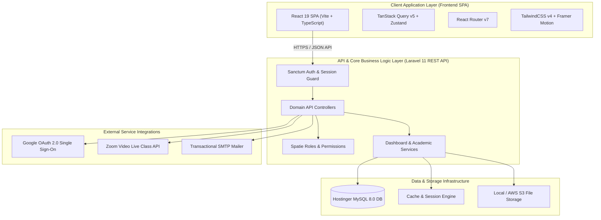

# 🎓 EduFlow AI - Enterprise Tuition & Learning Management System

[](https://tuition.imakshay.in)
[](https://react.dev)
[](https://laravel.com)
[](https://www.typescriptlang.org/)
[](https://tailwindcss.com)

---

## 📌 Project Overview

**EduFlow AI** is a state-of-the-art, full-stack enterprise digital classroom and tuition management portal engineered for private tutors, educational institutes, and competitive examination coaching (JEE, NEET, Board Exams).

Designed with mobile-first responsiveness, rich aesthetics, and dark-mode themes, EduFlow offers high-performance student portals, live video class integrations, assignment submission desks, automated PDF certificate generation, multi-device security locking, and comprehensive academic analytics.

---

## 🏗️ System Architecture



---

## ⭐ Key Features

### 🛡️ Admin Portal (`/admin/*`)
- **System Overview Dashboard**: Aggregate metrics for active students, active batches, revenues, and platform usage.
- **Academic Taxonomy Management**: Manage Education Types, Academic Programs, Subjects, and Academic Sessions.
- **User & Role Management**: Multi-tier role assignment (Admin, Teacher, Student) using Spatie RBAC.
- **Security & Multi-Device Control**: View active device sessions, enforce IP/device bindings, and revoke suspicious logins.
- **Platform & OAuth Settings**: Configure platform branding, API endpoints, Google OAuth Client IDs, and SMTP servers dynamically.

### 👨‍🏫 Teacher Portal (`/teacher/*`)
- **Compact Hero Header & Quick Actions**: Single-line compact header with direct live stream launch & refresh triggers.
- **Batch & Course Management**: Assign subjects, taxonomy modules, chapters, downloadable PDF notes, and YouTube video lectures.
- **Student Performance Desk**: Track student attendance, exam test attempts, assignment submissions, and progress indicators.
- **Automated Certificate Generation**: Issue downloadable course completion certificates.
- **Realtime Discussion Desk**: Direct messaging and chat threads with enrolled batch students.

### 🎓 Student Portal (`/student/*`)
- **Mobile-App Native Design**: Locked viewport height, floating pill glass navigation bar (`MobileBottomNav.tsx`), and touch-friendly interface.
- **Personalized Dashboard**: Today's schedule, pending assignments, recent announcements, and course progress bars.
- **Interactive Video Player**: Stream lesson videos with free previews, module progress saving, and note downloads.
- **3D Card Flip Auth**: Instant front/back Y-axis card flip for credentials sign-in and password recovery without full page reloads.

---

## 🛠️ Technology Stack

| Domain | Technology | Description |
| :--- | :--- | :--- |
| **Frontend Core** | React 19, TypeScript 6, Vite 8 | Ultra-fast client build & type safety |
| **Styling & UI** | TailwindCSS 4.3, Framer Motion, Lucide Icons | Glassmorphism, 3D card flips, responsive CSS |
| **State & Fetching** | TanStack React Query v5, Zustand | Server state caching & lightweight UI state |
| **Backend Core** | PHP 8.4, Laravel 11.0 | RESTful API architecture |
| **Authentication** | Laravel Sanctum, Google Socialite OAuth 2.0 | Bearer token auth & OAuth 2.0 |
| **Database** | MySQL 8.0 (Hostinger Cloud DB) | Relational database schema with 18+ domain models |
| **PWA & SW** | Vite Plugin PWA, Workbox | Service Worker caching & offline web app support |

---

## 🚀 Quick Start & Installation

### Prerequisites
- **Node.js**: `v20.x` or later
- **PHP**: `v8.2` or `v8.4`
- **Composer**: `v2.x`
- **MySQL Database**: `v8.0`

### 1. Repository Setup
```bash
git clone https://github.com/MrAkshay143/tuition.git
cd tuition
```

### 2. Frontend Installation & Build
```bash
cd frontend
npm install
npm run build
```

### 3. Backend Setup
```bash
cd ../backend
composer install
cp .env.example .env
php artisan key:generate
php artisan migrate --seed
```

---

## ⚙️ Environment Configuration

### Frontend (`frontend/.env`)
```env
VITE_API_URL=/api/v1
VITE_APP_NAME="EduFlow AI"
VITE_BACKEND_URL="/"
VITE_CONTACT_ADDRESS="Sector 62, Noida, Uttar Pradesh, India"
```

### Backend (`backend/.env`)
```env
APP_NAME="EduFlow"
APP_ENV=production
APP_URL="https://tuition.imakshay.in/api_backend/public"
FRONTEND_URL="https://tuition.imakshay.in"

DB_CONNECTION=mysql
DB_HOST=127.0.0.1
DB_PORT=3306
DB_DATABASE=u581617111_tuition
DB_USERNAME=u581617111_tuitionuser
DB_PASSWORD="YourPasswordHere"

SANCTUM_STATEFUL_DOMAINS=tuition.imakshay.in
SESSION_DOMAIN=.imakshay.in
```

---

## 🧪 Testing & Verification

### Run Type Checking
```bash
cd frontend
npx tsc --noEmit
```

### Run Production Build Test
```bash
cd frontend
npm run build
```

### Run Backend Migrations & Seeders
```bash
cd backend
php artisan migrate:fresh --seed
```

---

## 📂 Project Structure

```
Online Tuition/
├── backend/                        # Laravel 11 API Server
│   ├── app/
│   │   ├── Domains/                # Domain-Driven Design Modules
│   │   │   ├── Academic/           # Education Types, Programs, Subjects
│   │   │   ├── Core/               # Users, Batches, Authentication
│   │   │   ├── Course/             # Courses, Modules, Chapters, Lessons
│   │   │   ├── Media/              # Video & PDF Media Management
│   │   │   └── Settings/           # Platform Settings Key-Value Store
│   │   └── Http/Controllers/Api/   # REST Controllers & API Endpoints
│   ├── database/
│   │   ├── migrations/             # Database Schemas
│   │   └── seeders/                # Master Database Seeders
│   └── routes/
│       └── api.php                 # Public & Authenticated API Routes
│
├── frontend/                       # React 19 SPA
│   ├── src/
│   │   ├── api/                    # Axios API Client & Interceptors
│   │   ├── components/             # Reusable UI Components & Layouts
│   │   │   └── layout/             # Sidebar, Header, MobileBottomNav
│   │   ├── features/               # Feature Modules
│   │   │   ├── admin/              # Admin Settings & Operations
│   │   │   ├── auth/               # 3D Card Flip Login & Reset
│   │   │   ├── dashboard/          # Teacher & Student Dashboards
│   │   │   └── chat/               # Realtime Chat Module
│   │   ├── index.css               # Global CSS & Design System
│   │   └── main.tsx                # Application Entrypoint
│   └── package.json
│
├── deploy.py                       # Automated SSH/SFTP Python Deployment Script
├── root.htaccess                   # Production Apache / LiteSpeed Rewrite Rules
└── README.md                       # Repository Documentation
```

---

## 🚢 Deployment Guide

Deployment is fully automated via the included SSH/SFTP Python deployment script `deploy.py`:

```bash
python deploy.py
```

### What `deploy.py` Executes Automatically:
1. Compiles frontend assets via `npm run build`.
2. Packages clean dist bundle and backend source code into `tuition_deploy.zip`.
3. Connects securely via SSH/SFTP to the Hostinger production server.
4. Extracts assets into `/home/u581617111/domains/tuition.imakshay.in/public_html`.
5. Runs `composer install --no-dev --optimize-autoloader`.
6. Executes `php artisan migrate --force` and `php artisan db:seed --class=DatabaseSeeder --force`.
7. Clears and optimizes Laravel configuration and route caches (`config:cache`, `route:cache`).
8. Performs a automated HTTP 200 health check verification.

---

## 🤝 Contribution Guidelines

1. Fork the repository on GitHub.
2. Create your feature branch (`git checkout -b feature/amazing-feature`).
3. Ensure type checks pass (`npx tsc --noEmit`).
4. Commit your changes (`git commit -m 'feat: Add amazing feature'`).
5. Push to the branch (`git push origin feature/amazing-feature`).
6. Open a Pull Request.

---

## 📜 License & Copyright

Copyright © 2026 **EduFlow AI**. All rights reserved. Distributed under the MIT License.
