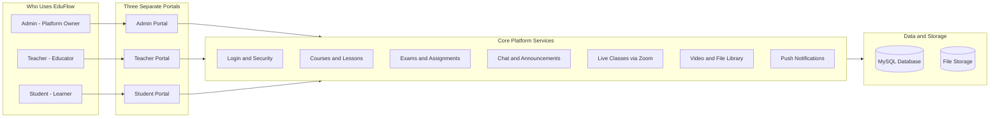

# EduFlow - Private Digital Classroom

[](https://tuition.imakshay.in)
[](https://tuition.imakshay.in)
[](https://tuition.imakshay.in)

> **EduFlow** is a complete private digital classroom platform built for coaching institutes and tuition centers. It gives Admins full control, Teachers powerful teaching tools, and Students a smooth, app-like learning experience - all in one place, accessible on any device.

---

## 🌐 Live Platform

| Link | What It Does |
|------|--------------|
| [tuition.imakshay.in](https://tuition.imakshay.in) | Main student & teacher app |
| [Admin Panel](https://tuition.imakshay.in/admin) | Full platform control centre |

---

## 🗺️ How It All Fits Together



---

## 👥 Three User Types

| User | Role | What They Can Do |
|------|------|-----------------|
| 🔐 **Admin** | Platform Owner | Manage everything - users, content, settings, security, backups |
| 👨‍🏫 **Teacher** | Educator | Create courses, take live classes, set exams, manage students |
| 🎓 **Student** | Learner | Watch lessons, attend live classes, submit assignments, take exams |

---

## 🔐 Admin Panel - Everything Under One Roof

The Admin is the platform owner. From the admin panel, everything can be configured and controlled without touching any code.

### 📊 Overview Dashboard
- See total students, teachers, courses, and live sessions at a glance
- View charts: new enrollments over time, course completion rates
- Monitor system health and recent platform activity

### 👤 User Management
- Add, edit, or remove admin accounts, teachers, and students
- Enable or disable any account with one click
- Force-logout a user from all their devices instantly
- Reset passwords for any account

### 🔑 Roles & Permissions
- Control exactly what each role (Admin, Teacher, Student) can access
- Toggle permissions on or off for each role from a simple checklist UI
- Ensure teachers only see what they need, students only see their content

### ⚙️ Platform Settings
| Section | What You Can Change |
|---------|---------------------|
| General | Platform name, logo, timezone |
| Branding | Colors, favicon, banner |
| Integrations | Google Login settings, API endpoints |
| Email | SMTP mail server configuration |
| Notifications | Push notification (FCM) settings |
| Security | Session rules, device limits, auto-logout |
| Storage | File upload limits, storage paths |

### 📢 Announcement Blast
- Send announcements to everyone, a specific role, a batch, or individual students
- Set priority: Normal, Important, or Urgent
- Schedule announcements in advance
- See who has read your announcement

### 🎓 Academic Taxonomy
Manage the full educational structure of your institute:
- **Education Types** - School, Undergraduate, Postgraduate, etc.
- **Programs** - Courses of study under each education type
- **Subjects** - Subjects linked to each program
- **Academic Sessions** - Academic years and terms

All of these support create, edit, delete, and restore.

### 🏫 Batch Management
- Create and manage student groups (batches)
- Add or remove multiple students from a batch at once
- Assign courses to a batch so all students get access together
- See batch-level stats: enrollment count, completion rate

### 📚 Courses & Content Builder
- Create courses with thumbnails, descriptions, and subject tags
- **Drag-and-drop Course Builder** - build modules and lessons visually
- Lessons can have: video (self-hosted, YouTube, or Vimeo), PDF notes, free preview toggle
- Publish, unpublish, archive, or duplicate any course
- Save version snapshots - restore any older version of a course

### 🎬 Media Library
- Upload and organise videos, PDFs, images, and documents
- Embed YouTube and Vimeo videos
- Bulk delete, publish, archive, or categorise files
- Recycle bin - restore accidentally deleted files
- Track which lessons are using each media file

### 📝 Assignments
- Create assignments with due dates, marks, and target batch or course
- See all submissions from every student
- Grade work with a score and written feedback
- Download submitted files

### 📋 Exams & Question Bank
- Create exams with timer, total marks, pass mark, and attempt limits
- Maintain a global question bank with topics, difficulty levels, and question types
- Questions can be reused across multiple exams
- View every student's attempt with a per-question breakdown

### 🎥 Live Classes
- Schedule Zoom-powered live sessions linked to a batch
- Start and end sessions from the admin panel
- View who attended each session

### 🔒 Security Centre
- Set rules: how many devices a user can be logged in on, idle logout time
- Override security settings per individual user if needed
- Block suspicious IP addresses
- Force a password reset for all users at once
- Clear "Remember Me" login tokens globally

### 📱 Device Sessions
- See every active login across all users: device type, IP address, browser, last activity time
- Revoke any session instantly
- Mark devices as trusted or untrusted

### 📋 Activity Logs
- Full audit trail of every action on the platform
- Filter by user, role, action type, date, and IP address
- Export logs as a CSV file

### 💾 Backup & Restore
- Create a full database + files backup with one click
- View backup history with file size and date
- Restore from any previous backup
- Download backup archives
- Export student, batch, exam, and assignment data as CSV

### 🖥️ Platform Operations
- View server health: PHP version, database status, queue status
- Clear system caches from the panel (no server access needed)

---

## 👨‍🏫 Teacher Portal - Full Feature Reference

Teachers have a dedicated panel to run their teaching operations end-to-end.

### Dashboard
- Stats at a glance: total students, active batches, published courses, pending assignment submissions
- Today's live class schedule
- Recent student activity (submissions, exam attempts)
- Notification bell with unread count

### Students
- Searchable student list with filter by batch and status
- **Student profile page**: view their courses, lesson progress, assignment grades, exam scores, device sessions, and attendance
- Add new students, assign/remove from batches and courses
- Suspend, activate, force-logout, reset passwords
- Send push notifications to individual students

### Batches
- Create and manage study groups
- Batch detail: student list, assigned courses, edit group info
- Bulk-sync students in or out of a batch

### Courses & Course Builder
- Create courses with description, subject, and pricing (free or paid)
- **Drag-and-drop builder**: add modules (chapters) and lessons in any order
- Each lesson: add video (upload, YouTube, or Vimeo), PDF notes, free preview toggle
- Autosaves on every change - no work is lost
- Version history and course import/export

### Content Library, Videos & Notes
- Upload and manage all teaching materials in one place
- Separate organised views for videos and PDF notes
- Reuse any uploaded file across multiple lessons easily

### Live Classes
- Schedule live sessions (Zoom) linked to a specific batch
- Start and end sessions with one click
- View attendance records per session

### Assignments
- Create tasks with due dates, mark allocations, and target batch or course
- Grade student submissions with a score and feedback
- Download submitted files

### Exams
- Create and configure exams with timing and rules
- Manage the shared question bank
- Review student attempts with detailed analytics

### Certificates
- View certificates auto-issued when students complete a course

### Announcements
- Post announcements targeted to your students
- See who has read them

### Chat
- 1-on-1 messaging with any student or admin
- Real-time message updates
- Unread message badge counts

### Calendar
- See live classes, assignment due dates, and exam schedules in a calendar view
- Monthly, weekly, and daily modes

### Analytics
- Per-course completion and drop-off rates
- Per-student engagement scores
- Exam pass/fail ratios and average scores
- Assignment submission and grade distribution charts

### Settings & Profile
- Update profile picture, name, bio, and email
- Change password and manage active devices
- Switch theme (Light / Dark / System)
- Set notification preferences

---

## 🎓 Student Portal - Full Feature Reference

Students get a clean, app-like experience designed entirely around learning.

### Dashboard
- Resume where you left off (last lesson with saved position)
- Overall course completion ring
- Today's live class schedule
- Pending assignments and upcoming exams
- Recent announcements

### My Courses
- All enrolled courses with per-course progress percentage
- Filter: In Progress, Completed, Not Started

### Lesson Viewer
- Watch videos: self-hosted (with adaptive streaming), YouTube, or Vimeo - all in one premium player
- Progress is saved automatically every few seconds - resume exactly where you stopped
- Works offline: progress is saved on your device and synced when back online
- Mark lessons as complete
- Bookmark any lesson for quick access later
- Module sidebar shows which lessons you've completed
- Locked lessons unlock automatically after you finish prerequisites

### Live Classes
- View and join Zoom sessions for enrolled batches
- Attendance is recorded automatically when you join

### Notes
- Access all PDFs and study materials shared across your courses and batches

### Assignments
- View all your tasks with due dates and current status
- Submit work with file upload
- See your grade and teacher's feedback once marked

### Exams
- View upcoming and past exams
- **Exam-taking experience**: countdown timer, auto-submits when time's up, flag questions for review, jump to any question quickly
- **Results page**: your score, pass/fail result, and correct answers for every question

### Progress Tracker
- Visual timeline of everything you've completed
- Per-course progress bars
- Quick shortcut to continue any course

### Chat
- Message your teacher or admin directly
- Real-time updates with unread count badge

### Calendar
- View your live class schedule, assignment deadlines, and exam dates

### Certificates
- Download your completion certificate (PDF) when you finish a course

### Settings & Profile
- Update your photo, name, and bio
- Change password
- See and revoke all your active device sessions
- Toggle notification preferences
- Switch between light and dark theme

---

## 🌍 Public Website

EduFlow also includes a full public-facing website - no login needed.

| Page | What It Shows |
|------|---------------|
| Home | Platform overview, features, and course highlights |
| About | Institution story and faculty |
| Courses | Browse all available courses |
| Course Detail | Course info with free lesson preview |
| Live Classes | Upcoming public live sessions |
| Study Materials | Publicly shared resources |
| Results | Student result showcase |
| Testimonials | Student reviews |
| Gallery | Photo gallery |
| Blog | Articles and updates |
| FAQ | Common questions answered |
| Contact | Contact form |
| Privacy Policy | Data usage policy |
| Terms of Service | Platform terms |
| Refund Policy | Refund information |

---

## 🔒 Security - Built for Trust

Every part of EduFlow is built with security as a first priority.

| Protection | How It Works |
|-----------|-------------|
| **Secure Login** | Passwords are always stored encrypted - never in plain text |
| **Google Login** | Sign in with Google via OAuth 2.0 (configurable from Admin Settings) |
| **Password Reset** | Secure time-limited reset links sent to email |
| **Device Binding** | Each login session is tied to the device that created it - sessions can't be shared |
| **Device Management** | Users can see and revoke all their own active sessions |
| **Admin Session Control** | Admins can view and kill any session across any user |
| **Session Policies** | Set idle logout time, max devices per user - per role or per person |
| **Rate Limiting** | Login attempts are rate-limited to prevent brute-force attacks |
| **Permission Control** | Every page and API route is gated by role permissions |
| **Audit Trail** | Every action is logged with user, time, IP, and what changed |
| **Trusted Devices** | Devices can be marked as trusted to reduce repeated prompts |

---

## 🛠️ Built With

### What Runs the App
| Layer | Technology |
|-------|-----------|
| **Frontend App** | React 19 + TypeScript - fast, modern, app-like experience |
| **Mobile-Ready** | PWA (Progressive Web App) - install on any phone or tablet |
| **Animations** | Smooth transitions using Framer Motion |
| **Charts** | Interactive data charts via Recharts |
| **Backend API** | Laravel 11 (PHP) - robust, proven, enterprise-grade framework |
| **Authentication** | Laravel Sanctum - secure token-based sessions |
| **Permissions** | Spatie RBAC - fine-grained role and permission control |
| **Database** | MySQL 8.0 - reliable relational database |

### Hosting & Services
| Component | Where / What |
|-----------|-------------|
| Hosting | Hostinger (cPanel Shared) |
| Domain | tuition.imakshay.in |
| SSL Certificate | Let's Encrypt (auto-renews) |
| Email | SMTP (configurable) |
| Push Notifications | Firebase Cloud Messaging |
| Video Calls | Zoom Meeting API |
| Google Login | Google OAuth 2.0 |
| Video Playback | YouTube + Vimeo embed + Self-hosted HLS streaming |

---

## 📁 Project Structure

```
Online Tuition/
├── backend/              # Laravel 11 API (server-side logic)
│   ├── app/Domains/      # Feature modules: Auth, Courses, Exams, Chat, etc.
│   ├── database/         # Database schema migrations and seed data
│   └── routes/api.php    # All 100+ API routes
│
├── frontend/             # React app (what users see in the browser)
│   ├── src/features/     # All portal pages (admin, teacher, student)
│   ├── src/components/   # Reusable UI components
│   ├── src/pages/        # Public website pages
│   └── src/router/       # Page routing for all three portals
│
├── deploy.py             # One-command deploy script to Hostinger
├── root.htaccess         # Web server config for single-page app routing
└── README.md
```

---

## 🚀 Deployment

All deployments are handled with a single command:

```bash
python deploy.py
```

This automatically:
1. Builds the latest frontend
2. Packages everything into a zip file
3. Uploads to Hostinger via SFTP
4. Extracts files to the correct server location
5. Runs database migrations and seeders
6. Optimises the server for performance

### Health Check After Deploy

```bash
curl https://tuition.imakshay.in/api_backend/public/api/v1/health
# Returns: {"status":"ok"}
```

---

## 🧑‍💻 Local Development Setup

### Prerequisites
- Node.js 20+, PHP 8.2+, Composer 2+, MySQL 8.0, Python 3.9+

### Backend

```bash
cd backend
composer install
cp .env.example .env
php artisan key:generate
# Fill in DB_*, GOOGLE_*, MAIL_* in .env
php artisan migrate --seed
php artisan serve
```

### Frontend

```bash
cd frontend
npm install
cp .env.example .env.local
# Set VITE_BACKEND_URL=http://localhost:8000/api/v1
npm run dev
```

### Test Accounts (seeded)

| Role | Email | Password |
|------|-------|----------|
| Admin | admin@eduflow.test | Admin@1234! |
| Teacher | teacher@eduflow.test | Teacher@1234! |
| Student | student@eduflow.test | Student@1234! |

---

## 📄 License

Private repository - all rights reserved.
Copyright © 2024-2025 EduFlow / Mr. Akshay.
