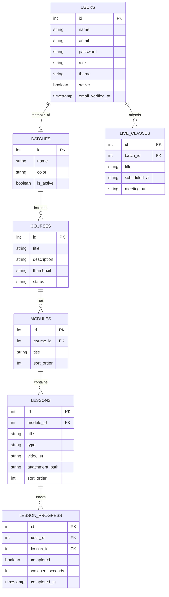

# Entity Relationship Diagram (ERD)
**EduFlow SaaS Platform**

Below is the visual relationship schema of the EduFlow database model.

```mermaid
erDiagram
    USERS ||--o| BATCHES : "member_of"
    USERS {
        int id PK
        string name
        string email
        string password
        string role
        string theme
        boolean active
        timestamp email_verified_at
    }

    BATCHES ||--o{ COURSES : "includes"
    BATCHES {
        int id PK
        string name
        string color
        boolean is_active
    }

    COURSES ||--o{ MODULES : "has"
    COURSES {
        int id PK
        string title
        string description
        string thumbnail
        string status
    }

    MODULES ||--o{ LESSONS : "contains"
    MODULES {
        int id PK
        int course_id FK
        string title
        int sort_order
    }

    LESSONS ||--o{ LESSON_PROGRESS : "tracks"
    LESSONS {
        int id PK
        int module_id FK
        string title
        string type
        string video_url
        string attachment_path
        int sort_order
    }

    LESSON_PROGRESS {
        int id PK
        int user_id FK
        int lesson_id FK
        boolean completed
        int watched_seconds
        timestamp completed_at
    }

    USERS ||--o{ LIVE_CLASSES : "attends"
    LIVE_CLASSES {
        int id PK
        int batch_id FK
        string title
        string scheduled_at
        string meeting_url
    }
```
